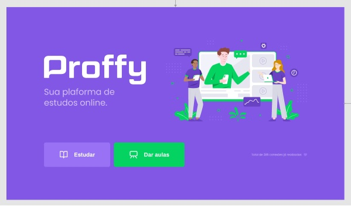
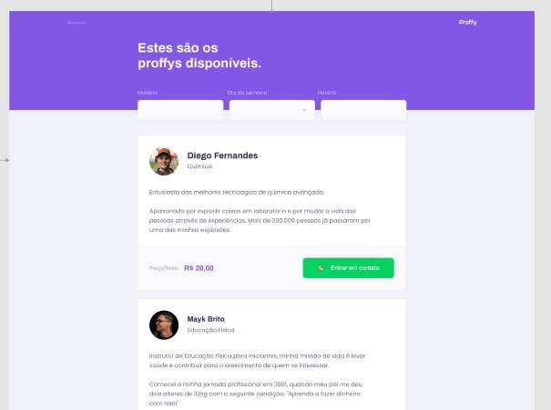
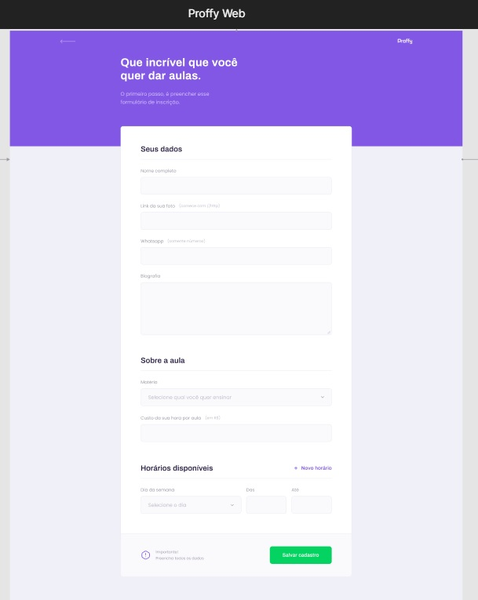
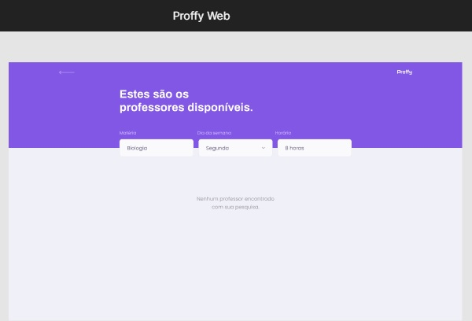
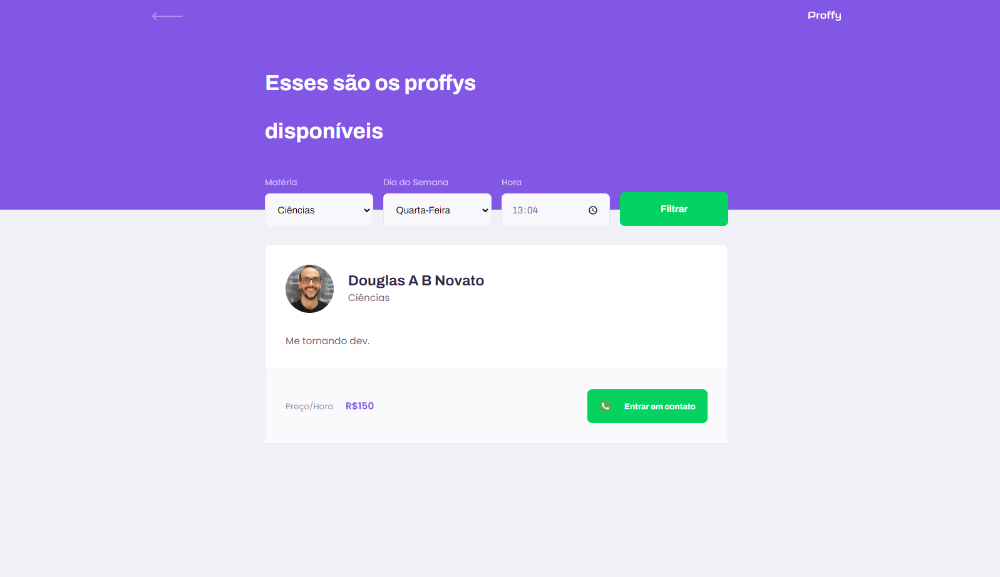

### Next Level Week 2

Um evento de programação organizado pelo Rocketseat para construir uma Page Landing seguindo um design apresentado no Figma.

### Proffy

- Proposta do design: Home 

- Proposta do design: Proffy 

- Proposta do design: Informações do Prof 

- Proposta do design: Professores Disponíveis 

#### Metodologia

- [x] v1.0.0 - Acelerando sua Evolução 
- [x] 0. Rocketseat
- [x] 0.1. Pilares do método do aprendizado
- [x] 0.1.1. Prática: o evento reune um conteúdo com clareza e atividades práticas, codando.
- [x] 0.1.2. Foco: Concentrar os esforços de estudos na mesma tecnologia, fazendo com que vamos ao próximo nível, ao invés de sair atirando para todos os lados, atrás da mais nova linguagem ou framework.
- [x] 0.1.3. Grupo: interação na comunidade com outros programadores mais experientes para receber ajuda. E também, com outros programadores que você pode ajudar. Para isso, a ferramenta Discord dentro da comunidade aberta da Rocketseat é uma ótima opção para colocar isso em prática. Completando o ciclo perfeito de aprendizado. Destaca o networking, e para isso, utilizar o Linkedin e o Github para aparecer para outros profissionais, recrutadores e empresas.

#### Front-End

- [x] 1. Front-End
- [x] 1.1. Programação Web
- [x] 1.1.1. O que é Programação
- [x] 1.1.1.1. Ensinar Computador 
- [x] 1.1.1.1.1. Algoritmos
- [x] 1.1.1.1.2. Lógica de Programação
- [x] 1.1.1.1.3. Sintaxe
- [x] 1.1.2. Linguagem de Programação
- [x] 1.1.2.1. Javascript 
- [x] 1.2. Configurar o ambiente de desenvolvimento
- [x] 1.2.1. Ferramentas 
- [x] 1.2.1.1. Navegador Chrome
- [x] 1.2.1.2. Editor de código VSCode
- [x] 1.3. Front-end e Back-end
- [x] 1.3.1. Imagina que
- [x] 1.3.2. Como é feita essa comunicação ?
- [x] 1.3.2.1. HTTP
- [x] 1.3.2.2. URL
- [x] 1.3.2.3. Troca de dados
- [x] 1.3.3. Tecnologias do Front-End
- [x] 1.3.3.1. HTML
- [x] 1.3.3.2. CSS
- [x] 1.3.3.3. Javascript
- [x] 1.3.4. Tecnologias do Back-End 
- [x] 2. Projeto
- [x] 2.1. Layout da aplicação, construído no Figma: [aplicação Proffy](https://www.figma.com/file/GHGS126t7WYjnPZdRKChJF/?viewer=1&node-id=)
- [x] 2.2. Arquivos que compõem a aplicação
- [x] 3. Introdução às Tecnologias
- [x] 3.1. HTML
- [x] 3.1.1. TAGs
- [x] 3.1.1.1. head 
- [x] 3.1.1.1.1. meta
- [x] 3.1.1.1.2. title
- [x] 3.1.1.1.3. link
- [x] 3.1.1.1.4. style
- [x] 3.1.1.2. body 
- [x] 3.1.1.2.1. div
- [x] 3.1.1.2.2. h1
- [x] 3.1.1.2.3. p
- [x] 3.1.1.2.4. a
- [x] 3.1.1.2.5. img
- [x] 3.2. CSS
- [x] 3.2.1. Responsivo
- [x] 3.2.1.1. Mobile First
- [x] 3.2.1.2. Unidades de Medida: rem, em
- [x] 3.2.2. Box-Model
- [x] 3.2.2.1. Tamanho de Conteúdo: width, height
- [x] 3.2.2.2. Preenchimentos
- [x] 3.2.2.3. Bordas
- [x] 3.2.2.4. Espaçamentos
- [x] 3.2.2.5. Displays
- [x] 3.2.2.6. Cores: fundo, fontes, sombrar, opacidade
- [x] 3.2.3. Layout
- [x] 3.2.3.1. Posicionamentos
- [x] 3.2.3.1.1. Displays
- [x] 3.2.3.1.2. Position: relative, absolute
- [x] 3.2.3.2. Alinhamentos 
- [x] 3.2.4. Texto
- [x] 3.2.4.1. Tamanho
- [x] 3.2.4.2. Tipo
- [x] 3.2.4.3. Espaçamentos
- [x] 3.2.4.4. Alinhamentos
- [x] 3.3. Javascript
- [x] 3.3.1. Variáveis
- [x] 3.3.2. Tipos de Dados
- [x] 3.3.3. Objetos
- [x] 3.3.4. Funções
- [x] 3.3.5. Condições
- [x] 3.3.6. Repetições

#### Back-End

- [x] v2.0.0 - Olhando as Oportunidades 
- [x] 0. A Home da Landing Page - css e html
- [x] 0.1.1. A estilização da aplicação "Mobile First."
- [x] 0.1.2. A estilização da aplicação "Desktop".
- [x] 0.1.3. A estilização da aplicação "Tablet".
- [x] 0.2. A Proffy da Landing Page - css e html
- [x] 0.2.1 Entender os elementos que estão no design
- [x] 0.2.2. Colocar os elementos da página
- [x] 0.2.3. Estilizar os elementos da página 
- [x] 0.2.4. Proposta do design: Proffy aplicando First Mobile
- [x] 0.2.5. Corrigir layout - page proffy - barra de pesquisa 
- [x] 1. Responsabilidades
- [x] 1.1. Receber pedidos do cliente
- [x] 1.2. Preparar os pedidos ( Regras de Negócio )
- [x] 1.3. Enviar respostas
- [x] 1.4. Lidar com dados da aplicação
- [x] 2. Tecnologias
- [x] 2.1. Linguagem: **[Javascript](https://developer.mozilla.org/en-US/docs/Web/javascript)**
- [x] 2.2. Node.js ([https://nodejs.org](https://nodejs.org/en/))
- [x] 2.3. Git Bash ([https://gitforwindows.org](https://gitforwindows.org/))
- [x] 2.4. [Banco de dados SQL](https://en.wikipedia.org/wiki/SQL)
- [x] 2.5. SQLite
- [x] 3. Bora Codar!
- [x] 3.1. Estrutura de pastas do projeto
- [x] 3.2. Criação do servidor
- [x] 3.2.1. Instalação dos módulos
- [x] 3.2.2. Configuração do servidor
- [x] 3.2.2.1. Criar e iniciar
- [x] 3.2.2.2. Página inicial
- [x] 3.2.2.3. Arquivos estáticos
- [x] 3.2.3. Rotas da aplicação
- [x] 3.2.3.1. Requisição e Resposta
- [x] 3.2.3.2. O que são verbos HTTP
- [x] 3.2.3.3. GET e POST
- [x] 3.2.3.4. Tipos de envio de dados
- [x] 3.2.3.4.1. Query Strings / Body
- [x] 3.2.3.4.2. Habilitar o express para utilizar o `req.body`
- [x] 3.2.4. Template Engine
- [x] 3.2.4.1. Instalar e configurar `nunjucks`
- [x] 3.2.4.2. Renderizar
- [x] 3.2.4.3. Enviar dados para o html
- [x] 3.2.4.4. Usando Nunjucks
- [x] 3.2.4.4.1. include
- [x] 3.2.4.4.2. variables
- [x] 3.2.4.4.3. extends
- [x] 3.2.4.4.4. block
- [x] 3.2.4.4.5. if
- [x] 3.2.4.4.6. for
- [x] 3.2.4.5. Instalar extensão `nunjucks-template` nas extensões VSCode
- [x] 3.2.5. Dados
- [x] 3.2.5.1. Enviando dados
- [x] 3.2.5.2. Recebendo dados
- [x] 3.2.5.3. Persistindo ( guardando ) banco de dados 

#### Front-End

- [x] v3.0.0 - A escolha da stack 
- [x] 1. Inserir o ícone no topo da aba do navegador
- [x] 2. Refatorar o código da page-study e da page-header : criado o `header.css`
- [x] 3. Construir a page-give-classes (dar aulas)
- [x] 3.1. Estrutura html para construir o layout.  
- [x] 3.2. HTML do formulário - Seus Dados
- [x] 3.3. CSS do formulário - Seus Dados 
- [x] 3.3.1. Mobile First
- [x] 3.3.2. Desktop
- [x] 3.4. HTML do formulário - Sobre a Aula
- [x] 3.5. CSS do formulário - Sobre a Aula
- [x] 3.5.1. Mobile First
- [x] 3.5.2. Desktop
- [x] 3.6. HTML do formulário - Horários Disponíveis
- [x] 3.7. CSS do formulário - Horários Disponíveis
- [x] 3.7.1. Mobile First
- [x] 3.7.2. Desktop 
- [x] 4. Construir o Javascript da Aplicação
- [x] 4.1. Procurar o botão
- [x] 4.2. Quando clicar no botão
- [x] 4.3. Executar uma ação
- [x] 4.3.1. Duplicar os campos
- [x] 4.3.2. Colocar na página 

#### Backe-End

- [x] v4.0.0 - Até dois anos em dois meses    
- [x] 1. Backe-End
- [x] 1.1. Criar o servidor
- [x] 1.1.1. Nodejs: v12.18.3 (LTS) 
- [x] 1.1.2. Estrutura de pastas: public, src
- [x] 1.1.3. `npm init -y`: gerenciamento de pacotes (dependências), cria o arquivo `package.json`
- [x] 1.1.4. Express - Biblioteca: `npm install express` 
- [x] 1.1.5. Servidor do projeto: `server.js`
- [x] 1.1.6. Comando `node src/server.js` roda nosso servidor na porta `http://127.0.0.1:5500/`
- [x] 1.1.7. Nodemon: a cada alteração, restart o servidor automaticamente `npm install nodemon -D`
- [x] 1.1.8. Configurar o Nodemon
- [x] 1.1.8.1. No package.json >> script >> trocar o item inteiro test por dev : nodemon src/server.js
- [x] 1.1.8.2. Rodar o servidor: `npm run dev`
- [x] 1.2. Criar as rotas da aplicação
- [x] 1.2.1. Botões com as rotas 
- [x] 2.1. HTTP
- [x] 2.2. GET e Post
- [x] 2.3. Localhost 
- [x] 2.4. Instalar Nunjucks: `npm install nunjucks` para renderização das rotas
- [x] 2.5. Configurar Nunjucks  
- [x] 3. Exibir as informações vindo do back-end
- [x] 3.1. Estrutura de repetição para exibir dados dos professores
- [x] 3.2. Estrutura de repetição com os dados dinâmicos
- [x] 3.3. Botão que utiliza api do whatsapp para enviar mensagem de contato para agendar aula do respectivo professor 
- [x] 3.4. Dados dinâmicos no formulário entre o back-end e o front-end
- [x] 4. Javascript
- [x] 4.1. Variáveis 
- [x] 4.2. Tipos de Dados 
- [x] 4.3. Objetos
- [x] 4.4. Funções 
- [x] 4.5. Condições
- [x] 4.6. Repetições 

#### Banco de Dados 

- [x] v5.0.0 - A milha extra - 07/08 - 02:48:41 
- [x] 0. Banco de Dados 
- [x] 0.1. Instalar SQLite - `npm install sqlite-async`
- [x] 0.2. Estrutura de pastas - src/database/db.js e src/database/database.sqlite 
- [x] 0.3. Construir o banco de dados 
- [x] 0.3.1. Estrutura de pastas e arquivos
- [x] 0.3.2. Comandos SQL - criar tabelas - `node src/database/db.js` 
- [x] 0.3.3. Plugin SQLite no VSCode - Open Database
- [x] 0.3.4. Teste - test.js : inserir dados manualmente
- [x] 0.3.5. Organizando os dados para inserção 
- [x] 0.3.6. Em db, atenção aos momentos de espera: async await
- [x] 0.3.7. Instrução map
- [x] 0.3.8. Instrução promise
- [x] 0.4. Rodar o db - `node src/database/test.js` 
- [x] 0.4.1. Construção das Query
- [x] 0.4.2. Database : dados, testes, utilidades
- [x] 0.5. Layout de Página Vazia no Study - no-results
- [x] 0.6. Criar escotilha para URL
- [x] 0.7.1. de GET para POST no formulário
- [x] 0.7.2. Tipos de envio de dados: query, strings, body 
- [x] 0.8. Aplicação
- [x] 0.8.1. Corrigir detalhes de funcionamento 
- [x] 1. Banco de Dados - SQLite
- [x] 1.1. Dados não devem ficar na aplicação 
- [x] 1.1.1. Perder/Corromper
- [x] 1.1.2. Segurança
- [x] 1.1.3. Responsabilidades
- [x] 1.2. SQL 
- [x] 1.2.1. Structured Query Language
- [x] 1.2.2. Linguagem para
- [x] 1.2.2.1. Criar
- [x] 1.2.2.2. Consultar
- [x] 1.2.2.3. Atualizar
- [x] 1.2.2.4. Deletar
- [x] 1.2.2.5. Mais...
- [x] 1.2.3. Tabelas - Entidades - Relações:
- [x] 1.2.3.1. Colunas e linhas  
- [x] 1.3. Tecnologia Utilizada
- [x] 1.3.1. [SQLite](https://www.sqlite.org/index.html)
- [x] 1.3.2. Open-source e fácil de configurar
- [x] 1.3.3. Banco de dados que reside na própria aplicação
- [x] 1.3.4. Excelente para quem está começando no mundo SQL
- [x] 2. Bora Codar!
- [x] 2.1. Instalar o `sqlite-async`
- [x] 2.2. Criar arquivo de configuração do banco de dados `db.js`
- [x] 2.3. Criar o objeto que irá fazer operações no banco de dados
- [x] 2.4. Operações
- [x] 2.4.1. Criar tabela no banco de dados
- [x] 2.4.2. Inserir um dado na tabela
- [x] 2.4.3. Consultar um dado na tabela
- [x] 2.4.4. Apagar um dado da tabela
- [x] 2.5. Exportar o objeto para ser usado em outro local
- [x] 2.6. Importar o banco de dados no server.js 
- [x] 2.7. Utilizar o banco de dados nas rotas

#### Encerramento 

- [ ] v6.0.0 - Terminado 
- [ ] 1. Revisar o código
- [ ] 1.2. Revisar os comentários
- [ ] 1.3. Revisar o Readme.md
- [ ] 2. Fazer o deploy da Aplicação
- [ ] 3. Escrever um artigo no Medium com as tecnologias, o desafio, o aprendizado, as dificuldades desse projeto
- [ ] 4. Publicar no Linkedin 
- [ ] 5. Live no Youtube - Encerramento NLW #2
- [ ] 6. Método de Aprendizado: Prática, Foco, Grupo 

#### Evoluir a aplicação

- [ ] v7.0.0 - Desafios
- [ ] 1. Página de sucesso
- [ ] 1.1. Mostrar página de sucesso após o cadastro do proffy
- [ ] 1.2. aguardar 2 segundos na página e redirecionar para a listagem dos proffys, com filtro
- [ ] 1.2.1. use setTimeout para aguardar os 2 segundos
- [ ] 1.2.2. location.href = ""
- [ ] 2. Correção de bugs
- [ ] 2.1. Não permitir o usuário colocar um novo campo de dia e horário, se o dia e hora anterior estiver vazio
- [ ] 2.2. Funcionalidade de deletar um campo de dia e hora

#### Resultado 
- Construindo a aplicação em versões.

  

## 🚀 Próximo passo

- responsividade
- acessibilidade
- modo dark / light
- variação de cores
- crud de ideias
- hospedar

---- 

.: Por [Douglas A B Novato - @douglasabnovato](https://linktr.ee/douglasabnovato) 
. De [Rocketseat - Next Level Week 2 - Discovery](https://nextlevelweek.com/inscricao/2)