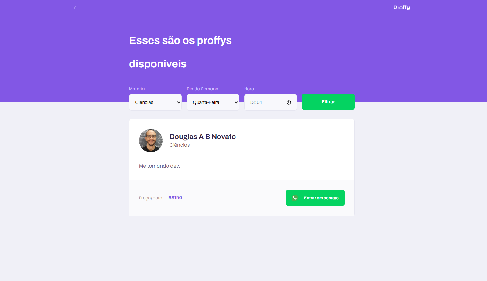
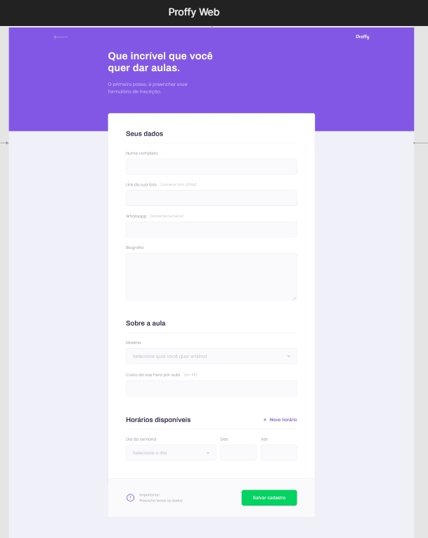
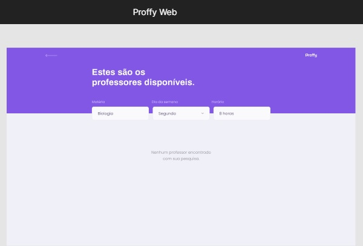

## Proffy



Conecta alunos a professores particulares por matéria, dia da semana e horário.

### Problema e proposta

Encontrar aula particular no horário certo depende de indicação. No Proffy o professor publica matéria, preço e horários; o aluno filtra e chama no WhatsApp.

- **Público:** estudantes do ensino básico e professores autônomos.
- **Métrica de sucesso:** conexões (contatos iniciados), contadas em `/contact/:id` e exibidas na home.

### Funcionalidades

- Cadastro de professor com vários horários, validação por campo e aviso de que os dados ficam públicos.
- Busca por matéria, dia e hora com intervalo correto (08:30–12:00 inclui 11:59, exclui 12:00).
- Botão "Entrar em contato" que conta a conexão e abre o WhatsApp com mensagem pronta.
- Páginas de sucesso, 404 e 500.

### Stack

Node 22 · Express 4 · Nunjucks · SQLite (better-sqlite3) · helmet · node:test + supertest.

### Como rodar

```sh
npm install
npm run dev     # http://localhost:5500
npm test        # 8 testes
```

Para migrar os dados antigos: `DATABASE_FILE=./src/database/database.sqlite npm start` (horários corrompidos pelo bug antigo são descartados).

### Em produção

- **URL:** https://proffy.onrender.com (Render, web service gratuito, blueprint `render.yaml`, deploy automático a cada push na `master`).
- GitHub Pages não serve aqui: o projeto tem servidor Express e banco SQLite, e o Pages só publica arquivos estáticos.
- O SQLite de produção fica em `/tmp/proffy.sqlite`: professores e conexões cadastrados **somem a cada reinício ou deploy** (o banco sobe vazio).
- Passo a passo completo (inclui mover `ci/` para `.github/workflows/`): [docs/DEPLOY.md](docs/DEPLOY.md).

### Design

| Home | Proffy | Informações | Disponíveis |
|---|---|---|---|
|  |  |  |  |

### Documentação

[docs/ANALISE.md](docs/ANALISE.md) · [docs/ARQUITETURA.md](docs/ARQUITETURA.md) · [docs/PLANO-DE-ACAO.md](docs/PLANO-DE-ACAO.md) · [docs/DEPLOY.md](docs/DEPLOY.md)

Projeto da NLW 2 (Rocketseat), evoluído por [@douglasabnovato](https://github.com/douglasabnovato).
