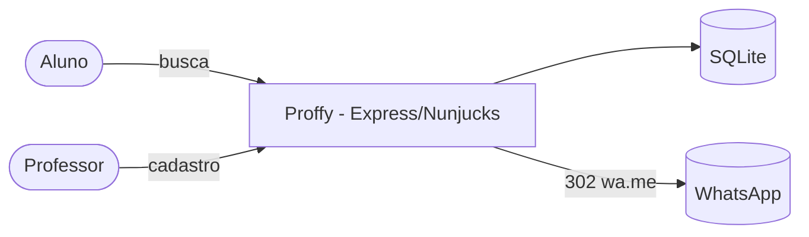
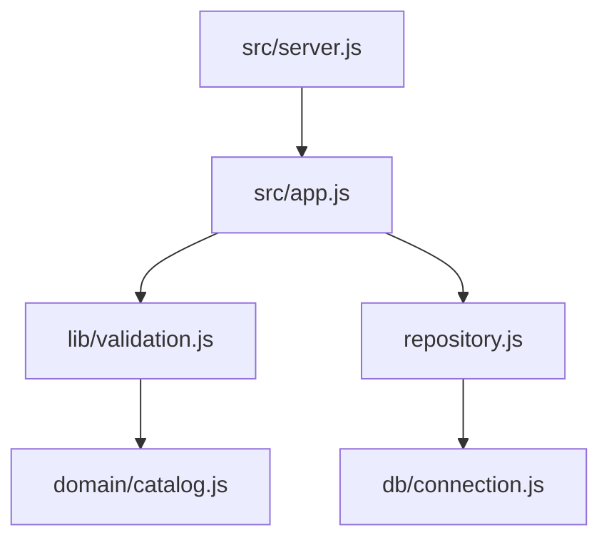

# Arquitetura — Proffy

## 1. C4





## 2. Modelo de dados (3FN)

```mermaid
erDiagram
  PROFFYS ||--o{ CLASSES : oferece
  CLASSES ||--|{ CLASS_SCHEDULE : tem
  PROFFYS { int id; text name; text avatar; text whatsapp; text bio }
  CLASSES { int id; int subject; int cost_cents; int proffy_id; int connections }
  CLASS_SCHEDULE { int id; int class_id; int weekday; int time_from; int time_to }
```

Horários em minutos desde 00:00; o intervalo é semiaberto `[time_from, time_to)`. Chaves estrangeiras com `ON DELETE CASCADE`; índice `(class_id, weekday, time_from, time_to)` atende a subconsulta `EXISTS` da busca.

## 3. Rotas

| Rota | Resposta |
|---|---|
| `GET /` | Home com conexões reais |
| `GET /study?subject&weekday&time` | Resultados (máx. 50, ordenados por preço) |
| `GET /give-classes` · `POST /give-classes` | Formulário · 303 `/success` · 422 |
| `GET /contact/:classId` | +1 conexão e 302 para `wa.me` · 404 |
| `GET /health` | `{ status, connections, proffys }` |

## 4. ADRs

- **ADR-001 — Horário em minutos com validação `HH:MM`.** Corrige a coerção de string e permite comparar intervalos com inteiros.
- **ADR-002 — Cadastro em uma transação.** Professor, aula e horários entram juntos ou nenhum entra.
- **ADR-003 — Conexão contada no servidor.** O link passa por `/contact/:id`, que incrementa o contador e redireciona; a métrica deixa de ser inventada.
- **ADR-004 — Migração conservadora.** Linhas legadas que não passam nas novas regras (ex.: `time_from = 69010`) são descartadas, não "consertadas" por palpite.

## 5. Fora do escopo

Login de professor para editar/remover o anúncio, avaliações, agenda com reserva.
